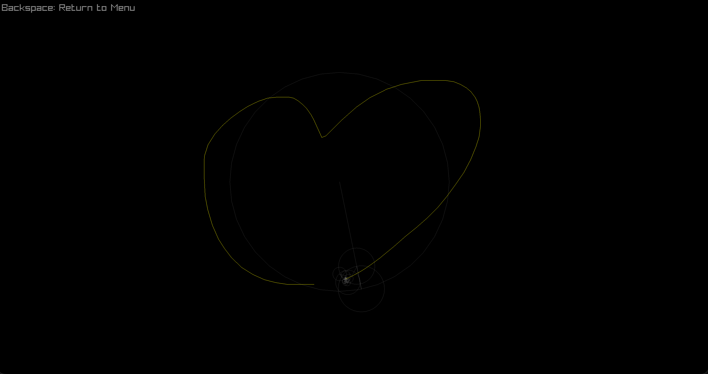

# Fourier Playground

A C++ project which utilises one of my favourite concepts in mathematics, the **Fourier Transform**. This project implements both the Discrete Fourier Transform (DFT) for vector drawing reconstruction and the Fast Fourier Transform (FFT) for real-time audio analysis.

### The Epicycle Drawer
*   Draw any continuous shape with your mouse.
*   The engine calculates the complex Fourier Series of your path.
*   Reconstructs your drawing using a chain of rotating vectors (epicycles).


### Audio Visualiser
*   Implements the **Cooley-Tukey FFT** algorithm to analyze audio
*   Low frequencies pulse in the center and high frequencies spike outwards.


### Discrete Fourier Transform (DFT)
Used in the **Drawing Machine**. It treats the 2D path as a series of complex numbers ($x_n$) and calculates the frequency ($X_k$):

$$X_k = \sum_{n=0}^{N-1} x_n \cdot e^{-\frac{i2\pi}{N}kn}$$

### Fast Fourier Transform (FFT)
Used in the **Audio Visualizer**. Because audio buffers are large (1024+ samples), a standard $O(N^2)$ DFT is too slow. I implemented the recursive **Cooley-Tukey** algorithm to reduce complexity to $O(N \log N)$.

### Dependencies
*   **Library:** [Raylib](https://www.raylib.com/)

### Build Instructions
1.  Clone the repository
2.  Compile using Make:
    ```bash
    make
    ```
3.  Run the application:
    ```bash
    ./fourier_draw
    ```

*(Note: Ensure a file named `song.mp3` is present in the directory for the visualiser to work.)*